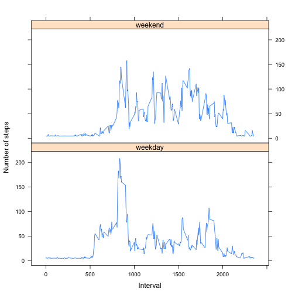

## Loading and preprocessing the data


```r
data <- read.table(unz("activity.zip", "activity.csv"), header=T, sep=",")
```
## What is mean total number of steps taken per day?
####1) Make a histogram of the total number of steps taken each day
Here I've created "totalsData" which sums up the activity data by day, creating step count totals for each. I then subset that dataset to just the step totals.


```r
totalsData = aggregate(steps ~ date, data=data, sum)
steps <- totalsData$steps
hist(steps)
```

 

####2) Calculate and report the mean and median total number of steps taken per day


```r
mean(steps)
```

```
## [1] 10766
```

```r
median(steps)
```

```
## [1] 10765
```

## What is the average daily activity pattern?
####1) Make a time series plot (i.e. type = "l") of the 5-minute interval (x-axis) and the average number of steps taken, averaged across all days (y-axis)


```r
totalsDataByInterval <- aggregate(steps ~ interval, data=data, mean)
plot(totalsDataByInterval$interval, totalsDataByInterval$steps, type="l", xlab= "5-minute interval", ylab= "Avg number of steps taken", main="Avg number of steps taken per 5-minute interval", lwd=2)
```

 

####2) Which 5-minute interval, on average across all the days in the dataset, contains the maximum number of steps?


```r
maxStepInterval <- totalsDataByInterval[which.max(totalsDataByInterval$steps),]$interval
maxStepInterval
```

```
## [1] 835
```

## Imputing missing values
####1) Calculate and report the total number of missing values in the dataset (i.e. the total number of rows with NAs)


```r
sum(is.na(data))
```

```
## [1] 2304
```

####2) Devise a strategy for filling in all of the missing values in the dataset. The strategy does not need to be sophisticated. For example, you could use the mean/median for that day, or the mean for that 5-minute interval, etc.
To populate missing values, I choose to replace them with the mean value for a 5-minute interval across the entire dataset.

####3) Create a new dataset that is equal to the original dataset but with the missing data filled in.


```r
library(Hmisc)
imputedData <- data
imputedData$steps <- with(imputedData, impute(steps, mean))
```


####4) Make a histogram of the total number of steps taken each day and Calculate and report the mean and median total number of steps taken per day. Do these values differ from the estimates from the first part of the assignment? What is the impact of imputing missing data on the estimates of the total daily number of steps?


```r
imputedTotalsData = aggregate(steps ~ date, data=imputedData, sum)
imputedSteps <- imputedTotalsData$steps
hist(imputedSteps)
```

 

Here we can see the imputed values has increased the average number of steps slightly (more frequent high activity days). 

Now, let's compare how these new means compare with those from the first part of the assignment above when we did not sub for the NAs.

With no imputed values:


```r
mean(steps)
```

```
## [1] 10766
```

```r
median(steps)
```

```
## [1] 10765
```

With imputed values:


```r
mean(imputedSteps)
```

```
## [1] 10766
```

```r
median(imputedSteps)
```

```
## [1] 10766
```


## Are there differences in activity patterns between weekdays and weekends?


* Create a new factor variable in the dataset with two levels -- "weekday" and "weekend" indicating whether a given date is a weekday or weekend day.


```r
imputedData$weekdays <- weekdays(as.Date(imputedData$date))
imputedData$weekdays <- ifelse(imputedData$weekdays %in% c("Saturday", "Sunday"), "weekend", 
    "weekday")
library(plyr)
average <- ddply(imputedData, .(interval, weekdays), summarise, steps = mean(steps))
library(lattice)
xyplot(steps ~ interval | weekdays, data = average, layout = c(1, 2), type = "l", 
    xlab = "Interval", ylab = "Number of steps")
```

 

